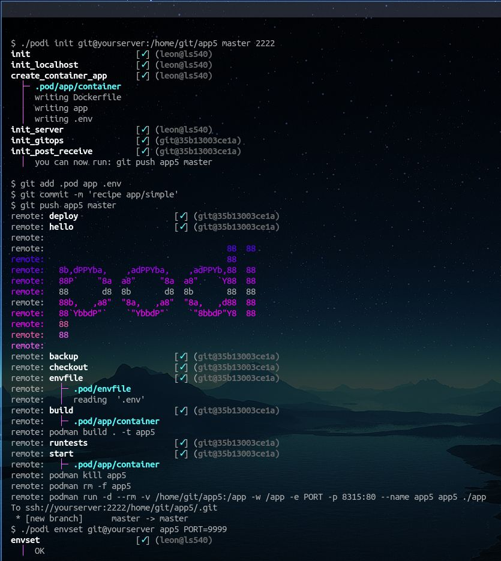

> remove layers of complexity.



## Usage

```
$ cd myapp 
$ wget "https://raw.githubusercontent.com/coderofsalvation/podi/master/podi"
$ chmod 755 podi
```

> PROFIT! now init your (ssh)server to enable a heroku-ish workflow:


## Features

* fully hackable PaaS & Gitops-designer (embedded in your repo)
* multitenant: multi-branch and multi-sshuser deployments 
* `podi ls`: gitops templates for containerizing, autosuspending services on baremetal/podman/docker etc
* hookable (`on build callmyfunction arg1`)
* podi weighs ~7k, just needs ssh+git installed
* works on raspberry pi zero but also on kubernetes

## Install

```bash
$ wget "https://raw.githubusercontent.com/coderofsalvation/podi/master/podi"
$ chmod 755 podi
$ ./podi
usage: 
    init git@server:/dir/to/deploy [branch] [port] [name]   initializes a deployment 
    recipe <name_or_url>                                    installs a recipe from podi repo or url
```

## Hooks / extend deployments 


## Templates

```bash
$ ./podi init git@yourserver:/home/git/myapp master

 [✓] init
 [✓] init_localhost
  │  writing .pod/pipeline
 [?] how to run this app?
     1  run/baremetal                <--  perfect to run background services on lowend systems
     2  run/baremetal_autosuspend    <--  perfect for port-activated services on lowend systems
     3  run/baremetal_webcli         <--  perfect for outputting terminal-cmds to web
     4  run/container                <--  nice starting point for Dockerfile + app 
     5  run/container_autosuspend    <--  port-activated container, nice starting point for Dockerfile + app 
     6  run/container_webcli         <--  containerized cli, perfect for outputting terminal-cmds to web
     7  run/container_compose        <--  containerized stack, nice startingpoint using docker-compose.yml 
  > ▉  
```

> IDEA: create your own! (see [adding your own recipes](doc/recipes.md) )

## Docs

* [adding your own recipes](doc/recipes.md)
